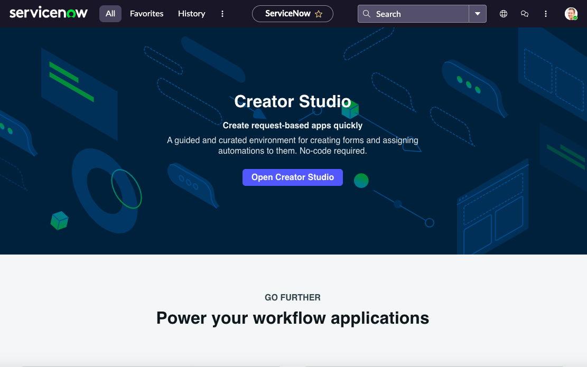
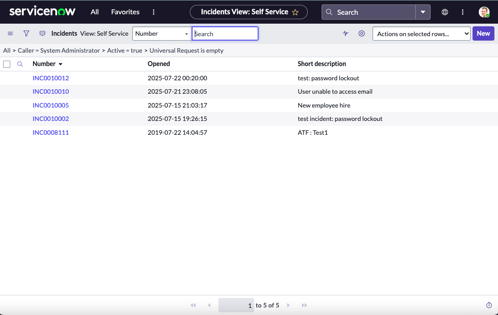

<h1>ServiceNow Ticket Simulation</h1>
<h2>Loom Video Walkthrough </h2>

- [Getting Started with ServiceNow](https://www.loom.com/share/d7ece94214fe4f6ba3d1bca4a2592571?sid=fd72e04d-c5d9-43e9-9113-6576bf8278e7)
<h2>Description</h2>
This project involves setting up and working within a ServiceNow developer instance to create and manage tickets. The goal of this lab is to gain hands-on experience with one of the most widely-used IT service management platforms and to build confidence navigating its interface and functionality. 
<br />


<h2>Creation of Developer Instance </h2>
<p style="margin-bottom: 20px;">To begin the lab, I created a free developer instance of ServiceNow. I used Google and searched the phrase "ServiceNow developer instance free" to find an official source.</p>

<p>Once I accessed the ServiceNow Developer Site, I registered for an account and requested a personal developer instance. This environment replicates a real-world ServiceNow interface and allows for full testing and experimentation with the platform.</p>
 


<h2>Types of Tickets </h2>
<p style="margin-bottom: 20px;">After setting up the instance, I navigated to the Incidents section where I could explore how tickets are created, searched, updated, and resolved.</p>

<p>Within the Incident Management module:</p>
<ul>
  <li>I observed different types of tickets that can be generated (e.g., Incidents, Problems, Changes).</li>
  <li>I practiced using filters and search bars to locate specific tickets.</li>
  <li>I updated ticket statuses directly from the interface, simulating the resolution of IT issues.</li>
</ul>



<!--
 ```diff
- text in red
+ text in green
! text in orange
# text in gray
@@ text in purple (and bold)@@
```
